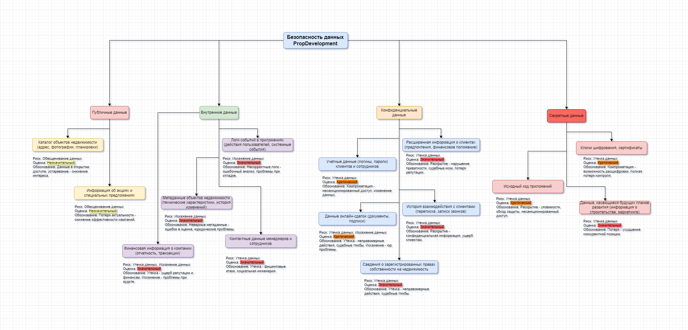

# Задание 1. Разработка проверочного листа по безопасности данных

Ссылка на схему Drawio: [Mindmap: Безопасность данных PropDevelopment](mindmap.drawio)

## 1. Безопасность данных

### 1.1. Публичные данные

#### 1.1.1. Данные: **Каталог объектов недвижимости** (адрес, фотографии, планировки)  
  **Риск:** Обесценивание данных  
  **Оценка:** Незначительный  
  **Обоснование:** Данные находятся в открытом доступе, устаревание или неактуальность информации может привести к снижению интереса клиентов, но не влечет серьезных финансовых или репутационных потерь.  

#### 1.1.2. Данные: **Информация об акциях и специальных предложениях**  
  **Риск:** Обесценивание данных  
  **Оценка:** Незначительный  
  **Обоснование:** Потеря актуальности информации о спецпредложениях ведет к снижению эффективности маркетинговых кампаний, но не к критическим последствиям.  

### 1.2. Внутренние данные

#### 1.2.1. Данные: **Логи событий в приложениях** (действия пользователей, системные события)  
  **Риск:** Искажение данных  
  **Оценка:** Значительный  
  **Обоснование:** Некорректные логи могут привести к ошибочному анализу поведения пользователей, проблемам при отладке и расследовании инцидентов безопасности.  

#### 1.2.2. Данные: **Метаданные объектов недвижимости** (технические характеристики, история изменений)  
  **Риск:** Искажение данных  
  **Оценка:** Значительный  
  **Обоснование:** Неверные метаданные могут привести к ошибкам в оценке недвижимости, юридическим проблемам при сделках.  

#### 1.2.3. Данные: **Контактные данные менеджеров и сотрудников**  
  **Риск:** Утечка данных  
  **Оценка:** Значительный  
  **Обоснование:** Утечка может привести к фишинговым атакам, социальной инженерии и другим видам мошенничества.  

#### 1.2.4. Данные: **Финансовая информация о компании** (отчетность, транзакции)  
  **Риск:** Утечка данных, Искажение данных  
  **Оценка:** Значительный  
  **Обоснование:** Утечка может нанести ущерб репутации компании и финансовым показателям. Искажение данных может привести к проблемам при аудите.  

### 1.3. Конфиденциальные данные

#### 1.3.1. Данные: **Расширенная информация о клиентах** (предпочтения, финансовое положение)  
  **Риск:** Утечка данных  
  **Оценка:** Значительный  
  **Обоснование:** Раскрытие может привести к нарушению приватности клиентов, судебным искам, потере репутации.  

#### 1.3.2. Данные: **Учетные данные** (логины, пароли) клиентов и сотрудников  
  **Риск:** Утечка данных  
  **Оценка:** Критический  
  **Обоснование:** Компрометация может привести к несанкционированному доступу к личным кабинетам, персональным данным, финансовым транзакциям, изменению данных.  

#### 1.3.3. Данные: **История взаимодействия с клиентами** (переписка, записи звонков)  
  **Риск:** Утечка данных  
  **Оценка:** Значительный  
  **Обоснование:** Раскрытие истории взаимодействия может содержать конфиденциальную информацию и нанести ущерб клиентам.  

#### 1.3.4. Данные: **Данные онлайн-сделок** (документы, подписи)  
  **Риск:** Утечка данных, Искажение данных  
  **Оценка:** Критический  
  **Обоснование:** Утечка может привести к неправомерным действиям со стороны третьих лиц, судебным тяжбам. Искажение может привести к юридическим проблемам.  

#### 1.3.5. Данные: **Сведения о зарегистрированных правах собственности на недвижимость**  
  **Риск:** Утечка данных  
  **Оценка:** Значительный  
  **Обоснование:** Утечка может привести к неправомерным действиям со стороны третьих лиц, судебным тяжбам.  

### 1.4. Секретные данные

#### 1.4.1. Данные: **Ключи шифрования, сертификаты**  
  **Риск:** Утечка данных  
  **Оценка:** Критический  
  **Обоснование:** Компрометация приведет к возможности расшифровки всех защищенных данных, полной потере контроля над системой.  

#### 1.4.2. Данные: **Исходный код приложений**  
  **Риск:** Утечка данных  
  **Оценка:** Критический  
  **Обоснование:** Раскрытие позволит злоумышленникам найти уязвимости в системе, обойти защиту и получить несанкционированный доступ.  

#### 1.4.3. Данные: **Данные, касающиеся будущих планов развития** (например, информация о запланированных к строительству объектах, маркетинговых стратегиях)  
  **Риск:** Утечка данных  
  **Оценка:** Значительный  
  **Обоснование:** Потеря может привести к ухудшению конкурентной позиции.  

### Дополнительные пояснения:

- Для классификации информации и управления рисками используются стандарты по информационной безопасности (**ISO/IEC 27001** и **27002**).  
- **Утечка данных:** Несанкционированный доступ к данным и их раскрытие.  
- **Потеря данных:** Полное или частичное уничтожение данных.  
- **Искажение данных:** Изменение данных, приводящее к их недостоверности.  
- **Некачественные данные:** Данные, которые содержат ошибки, устарели или не соответствуют требованиям.  
- **Обесценивание данных:** Данные, которые потеряли свою актуальность и не могут быть использованы.  

Этот mindmap отражает наиболее критичные области, требующие немедленного внимания в контексте безопасности данных PropDevelopment. После их выявления можно переходить к разработке конкретных мер по защите информации.  
