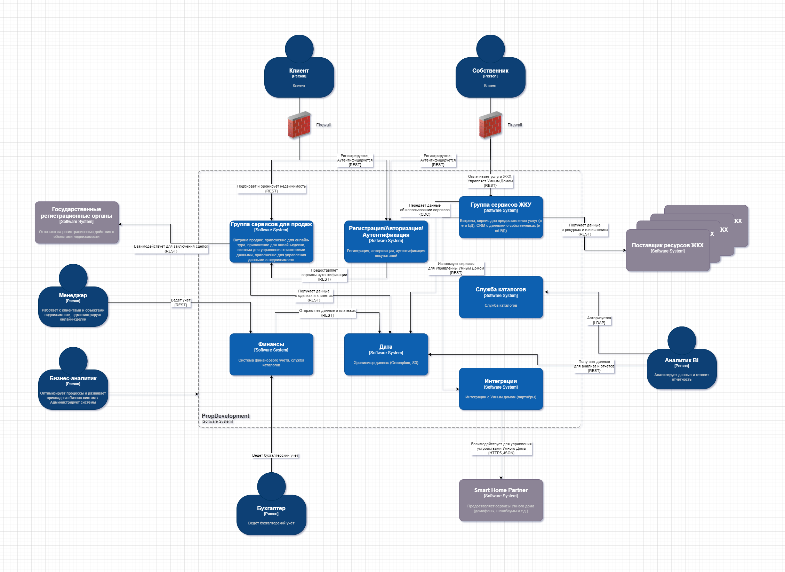
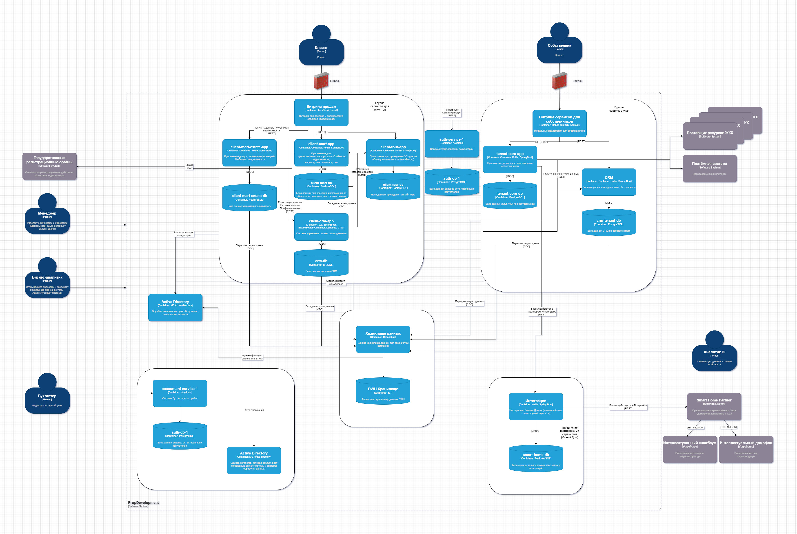

# Задание 3. Внешние интеграции

## 1. Диаграмма контекста в модели C4

Диаграмма контекста в модели C4 отражает контекст, в котором будут работать новые бизнес-функции.

Ссылка на схему Drawio: [Контекстная диаграмма C4 интеграции «PropDevelopment» с «Умный дом»](C4_Context_PropDevelopment_Integration.drawio)

### Пояснения к диаграмме:

- Диаграмма контекста показывает, как новые сервисы «Умный дом» вписываются в существующую систему PropDevelopment.  
- Основное взаимодействие происходит между мобильным приложением, бэкэндом PropDevelopment и платформой партнера по "Умному дому".  
- Платформа партнера управляет непосредственно устройствами (домофоном и шлагбаумом), используя собственные протоколы.  
- Диаграмма подчеркивает важность безопасного взаимодействия между системами, особенно при передаче персональных данных (биометрические данные, номера автомобилей).  

Эта диаграмма дает общее представление о контексте интеграции и позволяет лучше понять, как различные компоненты взаимодействуют друг с другом. Дальнейшие диаграммы (например, диаграмма контейнеров) могут быть использованы для более детального описания архитектуры системы.

## 2. Доработанная диаграмма контейнеров PropDevelopment

В ней отражены изменения, которые были предложены в связи с внедрением новых бизнес-функций в существующий ландшафт систем кампании.

Для доработки диаграммы контейнеров PropDevelopment необходимо учесть следующие аспекты внедрения новых бизнес-функций «Умный дом»:

1. **Добавление контейнера для интеграции с партнером:** Потребуется новый контейнер, который будет отвечать за взаимодействие с API партнера по "Умному дому". Это может быть отдельный микросервис, выполняющий роль адаптера между системой PropDevelopment и платформой партнера. Он реализует BFF (Backend For Frontend).

2. **Изменение в tenant-core-app:** Существующий контейнер tenant-core-app должен быть модифицирован для работы с новым контейнером интеграции с партнером. Он будет отвечать за обработку запросов от мобильного приложения и передачу их в контейнер интеграции.

3. **Изменение мобильного приложения:** Мобильное приложение tenant_showcase должно быть обновлено для предоставления пользователям доступа к новым сервисам «Умный дом». Интерфейс пользователя должен быть изменен для отображения информации о домофоне и шлагбауме, а также для управления этими сервисами (например, открытие двери, просмотр видео).

4. **Возможное добавление базы данных (зависит от реализации):** В зависимости от того, какие данные необходимо хранить на стороне PropDevelopment (например, информацию о правах доступа к сервисам «Умный дом», настройки пользователей), может потребоваться добавление новой базы данных или расширение существующей tenant-core-db.

### Доработанная диаграмма контейнеров:

Ссылка на схему Drawio: [Контейнерная диаграмма C4 интеграции «PropDevelopment» с «Умный дом»](C4_Container_PropDevelopment_Integration.drawio)

## Основные изменения и пояснения:

- **Добавлен контейнер smart_home_integration:** Этот контейнер отвечает за взаимодействие с API платформы партнера по "Умному дому". Он выполняет роль адаптера, преобразуя запросы от tenant_core_app в формат, понятный API партнера, и наоборот. Также может отвечать за аутентификацию и авторизацию запросов к API партнера, а также за обработку ошибок. Технологии реализации: Kotlin, SpringBoot (как и другие сервисы домена tenant).

- **Добавлена внешняя система smart_home_partner_ext:** Обозначает внешнюю платформу партнера, предоставляющую сервисы «Умный дом».

- **Изменена связь между tenant_core_app и smart_home_integration:** Теперь tenant_core_app взаимодействует с платформой партнера не напрямую, а через новый контейнер smart_home_integration.

- **Опциональная база данных smart_home_db:** В зависимости от требований к хранению данных на стороне PropDevelopment, можно добавить новую базу данных smart_home_db для хранения информации о правах доступа, настройках пользователей и других данных, связанных с сервисами «Умный дом». Если эти данные можно хранить в существующей tenant_core_db, то создание новой базы данных не требуется. Технология реализации: PostgreSQL (как и другие БД домена tenant).

- **Связи:**
  - **tenant_showcase -> tenant_core_app:** Мобильное приложение взаимодействует с основным сервисом управления собственниками.
  - **tenant_core_app -> smart_home_integration:** Основной сервис взаимодействует с адаптером умного дома.
  - **smart_home_integration -> smart_home_partner_ext:** Адаптер взаимодействует с внешней платформой умного дома.
  - **smart_home_integration -> smart_home_db:** (Опционально) Адаптер может взаимодействовать с базой данных для хранения локальных данных.

## Обоснование изменений:

- **Разделение ответственности:** Выделение отдельного контейнера для интеграции с платформой партнера позволяет разделить ответственность между основным сервисом tenant_core_app и логикой взаимодействия с внешней системой. Это упрощает разработку, тестирование и поддержку системы.

- **Абстракция:** Использование контейнера интеграции позволяет скрыть детали реализации API партнера от tenant_core_app. Это делает систему более гибкой и устойчивой к изменениям в API партнера.

- **Масштабируемость:** Выделение интеграции в отдельный контейнер позволяет масштабировать этот компонент независимо от tenant_core_app. Это может быть полезно, если нагрузка на сервисы «Умный дом» будет высокой.

- **Безопасность:** Контейнер интеграции позволяет централизованно управлять аутентификацией и авторизацией запросов к API партнера, что повышает безопасность системы.

Эта доработанная диаграмма контейнеров отражает изменения, необходимые для внедрения новых бизнес-функций «Умный дом» в ландшафт систем PropDevelopment, учитывая требования к безопасности, масштабируемости и гибкости.

## 3. Требования к внешним интеграциям сервисов «Умный дом» (Интеллектуальный домофон и Шлагбаум)

Опишем требования к интеграции сервисов "Интеллектуальный домофон" и "Интеллектуальный шлагбаум", предоставляемых сторонним партнером, в существующее мобильное приложение для собственников PropDevelopment. Требования охватывают аспекты безопасности, аутентификации/авторизации и взаимодействия между системами.

Ссылка на перечисленные ниже требования к внешним интеграциям:

[Требования к внешним интеграциям PropDevelopment](PropDevelopment_Integration_Requirements.md)

### I. Требования к безопасности:  
  
   1.1. **Общие требования:**  
      1.1.1. **Защита данных при передаче:** Все данные, передаваемые между системами PropDevelopment и платформой партнера, должны быть зашифрованы с использованием надежных криптографических протоколов (TLS 1.3 или выше) и алгоритмов шифрования (AES-256 или выше).  
      1.1.2. **Защита данных при хранении:** Все данные, хранящиеся на платформе партнера, должны быть зашифрованы в состоянии покоя (at rest). Должны быть приняты меры для защиты ключей шифрования.  
      1.1.3. **Минимизация передаваемых данных:** Передавать только строго необходимые данные для функционирования сервисов. Избегать передачи избыточной информации, особенно персональных данных.  
      1.1.4. **Регулярные аудиты безопасности:** Партнер должен проводить регулярные (не реже одного раза в год) независимые аудиты безопасности своих систем и предоставлять результаты аудита PropDevelopment.  
      1.1.5. **Соответствие законодательству:** Платформа партнера должна соответствовать требованиям законодательства РФ в области защиты персональных данных (ФЗ-152) и другим применимым нормативным актам.  
      1.1.6. **Соглашение об уровне обслуживания (SLA):** Необходимо заключить SLA с партнером, который включает в себя требования к доступности, производительности и безопасности сервисов.  
      1.1.7. **Пентесты:** Необходимо проводить регулярные (не реже двух раз в год) тесты на проникновение систем партнера.  
  		
   1.2. **Требования к сервису "Интеллектуальный домофон":**  
      1.2.1. **Защита биометрических данных:** Биометрические данные (изображения лиц) должны обрабатываться и храниться в соответствии с требованиями законодательства о защите биометрических данных. Использовать однонаправленные необратимые преобразования (хэширование).  
      1.2.2. **Контроль доступа к видеопотоку:** Доступ к видеопотоку с домофона должен быть строго ограничен и предоставляться только авторизованным пользователям.  
      1.2.3. **Предотвращение несанкционированного открытия двери:** Должны быть предусмотрены меры для предотвращения несанкционированного открытия двери (например, защита от replay-атак, таймауты сессий).  
  
   1.3. **Требования к сервису "Интеллектуальный шлагбаум":**  
      1.3.1. **Защита номеров автомобилей:** Номера автомобилей должны обрабатываться как персональные данные и защищаться от несанкционированного доступа.  
      1.3.2. **Контроль списка разрешенных номеров:** Список разрешенных номеров автомобилей должен быть надежно защищен от изменений со стороны неавторизованных пользователей.  
      1.3.3. **Предотвращение несанкционированного открытия шлагбаума:** Должны быть предусмотрены меры для предотвращения несанкционированного открытия шлагбаума (например, защита от replay-атак, таймауты сессий, проверка геолокации).  
  
### II. Протоколы аутентификации и авторизации:  
  
   2.1. **Аутентификация пользователей:**  
      2.1.1. **Использование существующих учетных данных:** Сервисы «Умный дом» должны использовать существующие учетные данные пользователей мобильного приложения PropDevelopment для аутентификации.  
      2.1.2. **Протокол аутентификации:** Рекомендуется использовать протокол OAuth 2.0 или OpenID Connect для делегирования аутентификации платформе PropDevelopment.  
  
   2.2. **Авторизация:**  
      2.2.1. **Ролевая модель:** Авторизация пользователей должна основываться на ролевой модели. Для каждого пользователя должна быть определена роль (например, собственник, член семьи, гость), которая определяет его права доступа к сервисам «Умный дом».  
      2.2.2. **Контроль доступа к ресурсам:** Должны быть реализованы механизмы контроля доступа к ресурсам (например, к видеопотоку с домофона, к списку разрешенных номеров автомобилей) на основе ролей пользователей.  
      2.2.3. **API Key или JWT для сервисов партнера:** Для аутентификации запросов от платформы PropDevelopment к API партнера необходимо использовать API Key или JSON Web Token (JWT). Ключи должны регулярно ротироваться.  
  
### III. Взаимодействие между системами предприятия и внешней платформой:  
  
   3.1. **Архитектура интеграции:**  
      3.1.1. **Использование API:** Взаимодействие между мобильным приложением PropDevelopment и сервисами «Умный дом» должно осуществляться через API партнера.  
      3.1.2. **Back-end for front-end (BFF):** Рекомендуется использовать шаблон BFF для создания промежуточного API, который адаптирует API партнера к потребностям мобильного приложения PropDevelopment.  
      3.1.3. **Шлюз API (API Gateway):** Использовать API Gateway для централизованного управления доступом к API партнера, мониторинга и трафик-шейпинга.  
  
   3.2. **Протоколы взаимодействия:**  
      3.2.1. **REST API:** API партнера должен быть реализован как REST API с использованием протокола HTTPS.  
      3.2.2. **Формат данных:** Рекомендуется использовать формат JSON для обмена данными.  
  
   3.3. **Порядок взаимодействия:**  
      1. Пользователь аутентифицируется в мобильном приложении PropDevelopment.  
      2. Мобильное приложение отправляет запрос на получение доступа к сервисам «Умный дом» через BFF.  
      3. BFF проверяет права доступа пользователя и, при необходимости, запрашивает информацию у платформы PropDevelopment (например, информацию о том, является ли пользователь собственником данной квартиры).  
      4. BFF отправляет запрос к API партнера с необходимыми данными и API Key/JWT.  
      5. Партнерская платформа обрабатывает запрос и возвращает результат.  
      6. BFF преобразует результат в формат, понятный мобильному приложению, и возвращает его пользователю.  
  
   3.4. **Мониторинг и логирование:**  
      3.4.1. **Логирование всех запросов:** Необходимо логировать все запросы к API партнера, включая информацию об источнике запроса, пользователе, времени запроса и результате.  
      3.4.2. **Мониторинг производительности:** Необходимо мониторить производительность API партнера (время отклика, количество ошибок) и оперативно реагировать на возникающие проблемы.  
      3.4.3. **Оповещения:** Необходимо настроить автоматические оповещения о критических событиях, таких как сбои в работе API, подозрительная активность или нарушения безопасности.  
  
### IV. Дополнительные требования:  
  
   4.1. **Обработка ошибок:** Необходимо предусмотреть обработку ошибок и предоставление понятных сообщений об ошибках пользователям.  
   4.2. **Документация:** Партнер должен предоставить подробную и актуальную документацию на свой API, включая описание всех методов, параметров и форматов данных.  
   4.3. **Тестирование:** Необходимо провести тщательное тестирование интеграции, включая функциональное тестирование, тестирование безопасности и нагрузочное тестирование.  

### V. Заключение:  

Соблюдение данных требований позволит обеспечить безопасную и надежную интеграцию сервисов «Умный дом» в мобильное приложение PropDevelopment, повысить удовлетворенность собственников и расширить функциональность платформы. Важно установить тесное сотрудничество с партнером и контролировать соблюдение требований на всех этапах интеграции и эксплуатации сервисов.
